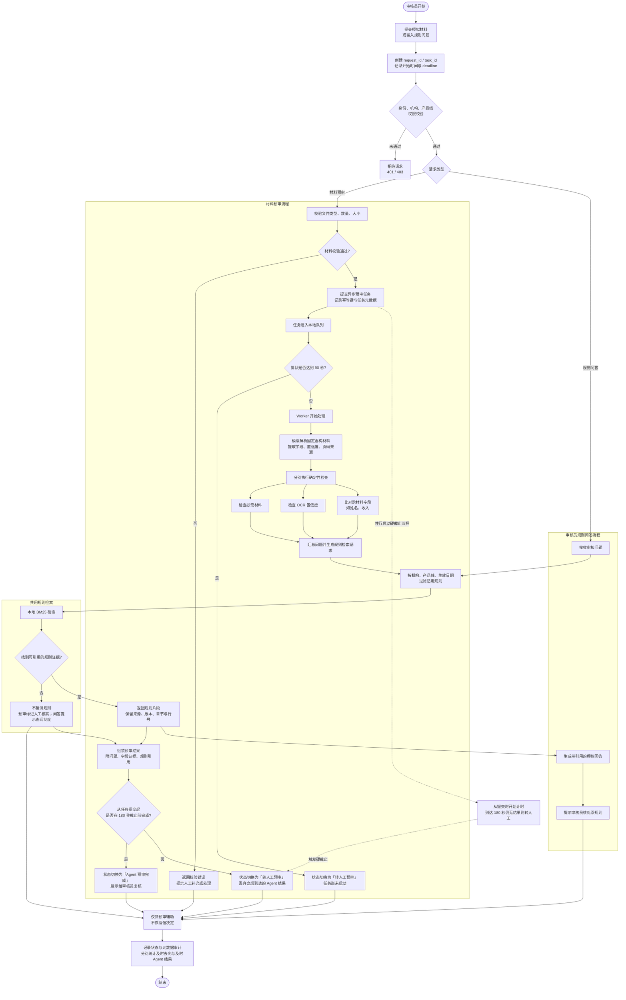

# 贷前材料预审流程图

> 本图对应当前项目的本地模拟流程。模拟 OCR 使用固定虚构字段，预审结果只供人工复核，不作授信决定。

```mermaid
flowchart TD
    A([审核员开始]) --> B[提交模拟材料<br/>或输入规则问题]
    B --> C[创建 request_id / task_id<br/>记录开始时间与 deadline]
    C --> D{身份、机构、产品线<br/>权限校验}
    D -- 未通过 --> E[拒绝请求<br/>401 / 403]
    D -- 通过 --> F{请求类型}

    subgraph PRECHECK[材料预审流程]
        direction TD
        P1[校验文件类型、数量、大小] --> P2{材料校验通过?}
        P2 -- 否 --> PERR[返回校验错误<br/>提示人工补充或处理]
        P2 -- 是 --> P3[提交异步预审任务<br/>记录幂等键与任务元数据]
        P3 --> P4[任务进入本地队列]
        P4 --> P5{排队是否达到 90 秒?}
        P5 -- 是 --> PMAN1[状态切换为「转人工预审」<br/>任务尚未启动]
        P5 -- 否 --> P6[Worker 开始处理]
        P6 --> P7[模拟解析固定虚构材料<br/>提取字段、置信度、页码来源]
        P7 --> P8[分别执行确定性检查]
        P8 --> P81[检查必需材料]
        P8 --> P82[检查 OCR 置信度]
        P8 --> P83[比对跨材料字段<br/>如姓名、收入]
        P81 --> P9[汇总问题并生成规则检索请求]
        P82 --> P9
        P83 --> P9
        P9 --> R1
        R4 --> P10[组装预审结果<br/>附问题、字段证据、规则引用]
        P10 --> P11{从任务提交起<br/>是否在 180 秒截止前完成?}
        P11 -- 是 --> POK[状态切换为「Agent 预审完成」<br/>展示给审核员复核]
        P11 -- 否 --> PMAN2[状态切换为「转人工预审」<br/>丢弃之后到达的 Agent 结果]
    end

    subgraph RULEQA[审核员规则问答流程]
        direction TD
        Q1[接收审核问题] --> R1
        R4 --> Q2[生成带引用的模拟回答]
        Q2 --> Q3[提示审核员核对原规则]
    end

    subgraph RETRIEVAL[共用规则检索]
        direction TD
        R1[按机构、产品线、生效日期<br/>过滤适用规则]
        R1 --> R2[本地 BM25 检索]
        R2 --> R3{找到可引用的规则证据?}
        R3 -- 否 --> R6[不猜测规则<br/>预审标记人工核实；问答提示查阅制度]
        R3 -- 是 --> R4[返回规则片段<br/>保留来源、版本、章节与行号]
    end

    F -- 材料预审 --> P1
    F -- 规则问答 --> Q1
    P3 -. 并行启动硬截止监控 .-> T1[从提交时开始计时<br/>到达 180 秒仍无结果则转人工]
    T1 -. 触发硬截止 .-> PMAN2

    POK --> Z[仅供预审辅助<br/>不作授信决定]
    PMAN1 --> Z
    PMAN2 --> Z
    PERR --> Z
    R6 --> Z
    R6 --> P10
    Q3 --> Z
    Z --> AUDIT[记录状态与元数据审计<br/>分别统计及时去向与及时 Agent 结果]
    AUDIT --> END([结束])
```
